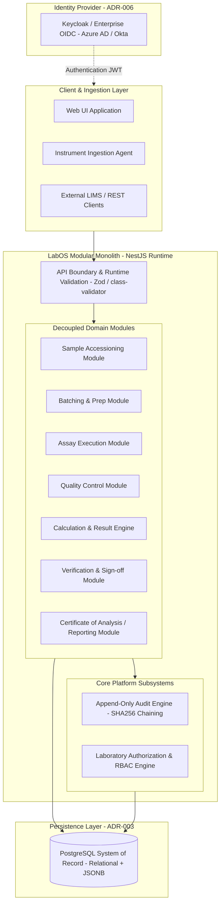

# LabOS — Architecture Overview

## 1. Executive Summary

**LabOS** is an open, high-integrity Laboratory Operating System designed to manage scientific operations—from sample accessioning to final authorized reporting (Certificate of Analysis)—with uncompromising data integrity, complete auditability, and regulatory readiness.

This document synthesizes the foundational architecture decisions recorded in [docs/07-decisions/](file:///c:/Users/nikhil/Desktop/projects/labos/docs/07-decisions/) into a unified system blueprint.

---

## 2. Core Architectural Pattern: The Modular Monolith

LabOS commits to a **Modular Monolith as its permanent default architecture** ([ADR-004](file:///c:/Users/nikhil/Desktop/projects/labos/docs/07-decisions/ADR-004-MODULAR-MONOLITH.md)). Microservices are explicitly **not** a planned destination.

### Why a Modular Monolith?
Scientific laboratory operations demand atomic consistency across multi-step workflows. A sample cannot be logged without generating an audit record, and a batch cannot be finalized without validating control samples. 

In a modular monolith:
- All domain modules run in the same deployable process and share the same PostgreSQL database transaction.
- Communication between modules happens via in-memory function calls and strongly typed interfaces, eliminating network failure modes and latency.
- AI coding tools and engineers can navigate, understand, and refactor the entire system locally without dealing with distributed tracing, service meshes, or network mocks.



---

## 3. Strict Exceptions for Satellite Workers

External services or background workers may **only** be introduced when there is a documented justification matching one of three criteria ([ADR-004](file:///c:/Users/nikhil/Desktop/projects/labos/docs/07-decisions/ADR-004-MODULAR-MONOLITH.md)):

1. **Extreme Isolated Compute:** Long-running CPU/GPU tasks (e.g., genomic alignment or 3D molecular folding) that would starve the web application.
2. **Essential Foreign Runtime:** Hardware or instrument vendor SDKs strictly requiring a non-Node.js runtime (e.g., C++, Python, C#).
3. **Security Sandboxing:** Isolated containers required to safely execute user-defined custom scripts.

These workers operate purely as **non-authoritative satellite workers**. The modular monolith remains the sole authority for business rules, state transitions, and audit records.

---

## 4. Domain Module Decomposition

The core business logic is partitioned into clean, cohesive domain modules inside NestJS (`@Module()`). Modules interact exclusively through defined service interfaces or in-process domain events.

```text
labos/
└── src/
    └── modules/
        ├── accessioning/       # Sample receiving, inspection, barcoding, metadata
        ├── preparation/        # Batching, aliquots, plate layout (96/384-well)
        ├── assay-execution/    # Instrument run parameters, protocol execution
        ├── quality-control/    # Blanks, calibration standards, matrix spikes, duplicates
        ├── calculation/        # Scientific calculations, exact decimal engine, flagging
        ├── verification/       # Scientific sign-off, four-eyes review, electronic sigs
        ├── reporting/          # Certificate of Analysis (CoA) generation, archiving
        ├── audit/              # Append-only ledger, canonical hashing, tamper-evidence
        └── identity/           # OIDC token verification, internal RBAC, permissions
```

### Module Responsibilities

| Module | Core Responsibility | Key Invariant |
| :--- | :--- | :--- |
| **Accessioning** | Intake physical samples, barcode scanning, condition verification. | Every sample receives a permanent UUID and accession number before any handling. |
| **Preparation** | Aliquot creation, plate mapping, reagent tracking. | Parent-child sample relationships are strictly preserved. |
| **Assay Execution** | Instrument runs, protocol execution tracking. | Raw instrument outputs and operational parameters are append-only. |
| **Quality Control** | Evaluating run validity against reference standards. | No sample result can be reported if associated QC controls fail acceptance criteria. |
| **Calculation** | Converting raw measurements to final analytical concentrations. | **No native JS floating point:** exact decimal math with deterministic unit tests. |
| **Verification** | Reviewing results, audit history, and issuing sign-off. | Four-eyes review: an analyst cannot verify their own analytical run. |
| **Reporting** | Compiling and releasing official Certificates of Analysis (CoA). | Once released, reports are immutable; amendments require formal addenda. |

---

## 5. Technology Stack & Scientific Rigor Standards

### Language & Framework ([ADR-002](file:///c:/Users/nikhil/Desktop/projects/labos/docs/07-decisions/ADR-002-TYPESCRIPT-NESTJS.md))
* **TypeScript:** Configured with maximum strictness (`"strict": true`, `"noImplicitAny": true`, `"strictNullChecks": true`).
* **NestJS:** Enforces modular architecture, dependency injection, and clean boundary separation.
* **Runtime Validation:** All inputs across HTTP endpoints, file parsers, and event listeners must be validated at runtime via strict schemas (`class-validator` / `Zod`).

### Scientific Decimal Engine ([ADR-002](file:///c:/Users/nikhil/Desktop/projects/labos/docs/07-decisions/ADR-002-TYPESCRIPT-NESTJS.md))
Binary floating-point arithmetic (IEEE 754) is prohibited for all critical scientific calculations to prevent rounding artifacts (e.g., `0.1 + 0.2 !== 0.3`).
* **In Code:** Arbitrary-precision decimal libraries (e.g., `decimal.js`) must be used for all measurements, calibration curves, limits of detection (LOD/LOQ), and recoveries.
* **In Database:** Stored exclusively in PostgreSQL `NUMERIC` / `DECIMAL` columns, never `FLOAT` or `DOUBLE PRECISION`.

---

## 6. Persistence Architecture ([ADR-003](file:///c:/Users/nikhil/Desktop/projects/labos/docs/07-decisions/ADR-003-POSTGRESQL.md))

PostgreSQL is the single, authoritative system of record for both local development and production.

* **ACID Transactions:** Multi-entity operations execute in atomic transactions to guarantee zero partial writes.
* **Foreign Keys & Constraints:** Referential integrity is enforced at the database level. Orphaned records are structurally impossible.
* **UUID Primary Keys:** All core entities use UUIDs (UUIDv7 for time-ordered performance, or UUIDv4) to guarantee collision-free identifiers.
* **Transactional Schema Migrations:** All schema changes are version-controlled, reproducible, and reversible through migration scripts wrapped in transactions.
* **PostgreSQL JSONB Boundary:** `JSONB` is strictly reserved for genuinely heterogeneous data (e.g., arbitrary instrument telemetry, raw chromatogram peak tables, or flexible metadata). Core relationships, statuses, and auditable events remain strictly relational.

---

## 7. Tamper-Evident Audit Trail ([ADR-005](file:///c:/Users/nikhil/Desktop/projects/labos/docs/07-decisions/ADR-005-AUDIT-INTEGRITY.md))

LabOS implements an append-only event ledger within PostgreSQL. Normal application `UPDATE` and `DELETE` operations are structurally blocked.

### Audit Record Structure
Every auditable event captures the **5 W's**:
* **Who (Actor):** Authenticated User ID, system agent, or automated process.
* **What (Action & Diff):** Domain action verb, target entity type, entity UUID, correlation ID, and serialized before/after diff.
* **When (Timestamp):** Immutable UTC timestamp.
* **Where:** Workstation ID, IP address, or API client.
* **Why (Reason):** Mandatory structured justification for any data modification, recalculation, or invalidation.

### Tamper-Evidence via Cryptographic Chaining
Each audit record contains the cryptographic hash of the previous record:
$$\text{Current Hash} = \text{SHA-256}(\text{Previous Hash} + \text{Canonical Event JSON})$$

```text
┌─────────────────────────┐       ┌─────────────────────────┐       ┌─────────────────────────┐
│      Audit Event 1      │       │      Audit Event 2      │       │      Audit Event 3      │
│  ID: 101                │       │  ID: 102                │       │  ID: 103                │
│  Action: SAMPLE_INTAKE  │       │  Action: RUN_EXECUTED   │       │  Action: RESULT_AMENDED │
│  PrevHash: 0000...0000  │       │  PrevHash: 8f4a...12bc  │       │  PrevHash: e3b0...99aa  │
│  Hash:     8f4a...12bc  ├──────►│  Hash:     e3b0...99aa  ├──────►│  Hash:     7c21...44ff  │
└─────────────────────────┘       └─────────────────────────┘       └─────────────────────────┘
```

* **Independent Verifiability:** If a record in the database is modified, deleted, or inserted out of sequence, the cryptographic hash chain breaks visibly, providing mathematical proof of tampering.

---

## 8. Identity & Authorization Architecture ([ADR-006](file:///c:/Users/nikhil/Desktop/projects/labos/docs/07-decisions/ADR-006-OIDC-IDENTITY.md))

LabOS enforces a strict architectural boundary between **Authentication** and **Authorization**:

```text
┌─────────────────────────────────────────────────────────────────────────┐
│           AUTHENTICATION ("Who are you?") — Delegated to IdP            │
│   • OpenID Connect (OIDC) & OAuth2 Standard                             │
│   • Local Dev: Self-hostable Keycloak (Docker)                          │
│   • Enterprise Prod: Microsoft Azure AD / Entra ID, Okta, Ping, LDAP    │
│   • LabOS NEVER stores user passwords or manages credential resets      │
└────────────────────────────────────┬────────────────────────────────────┘
                                     │ Issues Verified JWT
                                     ▼
┌─────────────────────────────────────────────────────────────────────────┐
│            AUTHORIZATION ("What can you do?") — LabOS Engine            │
│   • Domain Roles: Sample Accessioner, Analyst, QA Officer, Lab Director │
│   • Granular Permissions: 'samples:accession', 'reports:certify'        │
│   • Departmental & Laboratory Section Isolation                         │
│   • Electronic Signatures: Re-authentication workflows (21 CFR Part 11) │
└─────────────────────────────────────────────────────────────────────────┘
```

---

## 9. Target Domain & Phasing ([ADR-001](file:///c:/Users/nikhil/Desktop/projects/labos/docs/07-decisions/ADR-001-ISO-17025-FIRST.md))

* **Phase 0 (Current):** Documentation, Domain Modeling, and Architecture Blueprinting.
* **Initial Domain:** **ISO/IEC 17025 Analytical & Testing Laboratories** (environmental, chemical, and food safety testing).
* **Future Expansion:** The core engine acts as the direct technical prerequisite for **ISO 15189** (Clinical Diagnostics) and **GxP / 21 CFR Part 11** (Pharmaceuticals), which will be unlocked in later phases without redesigning the foundational core.
